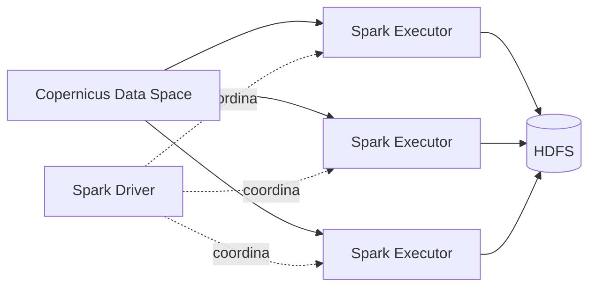

# Sergio Jiménez Macías

### Ingeniería Informática · Ingeniería de Computadores

**Redes y Sistemas · Infraestructura · Computación Distribuida · Ciberseguridad**

  
  

---

## Perfil

Graduado en **Ingeniería Informática, mención en Ingeniería de Computadores, por la Universidad de Extremadura**. Mi perfil está orientado a **redes, sistemas Linux, infraestructura, virtualización, sistemas distribuidos y ciberseguridad**.

A lo largo del grado he trabajado con entornos Linux, administración remota mediante SSH, virtualización, contenedores, orquestación, almacenamiento distribuido, computación paralela, comunicaciones IoT y programación de sistemas. Además, he realizado prácticas en el **Servicio de Informática y Comunicaciones de la UEx**, participando en tareas de análisis de seguridad.

---

# Ingeniería aplicada

## 🛰️ TFG · Ingesta distribuida de productos Sentinel
**Python · Apache Spark · Hadoop/HDFS · Copernicus Data Space Ecosystem**

Rediseño de un proceso de ingesta para distribuir la descarga de productos Sentinel entre los nodos de un clúster y almacenarlos directamente en **HDFS**, evitando concentrar la transferencia de datos en una única máquina.

**Trabajo técnico**
- Paralelización del proceso mediante **Spark**, particiones y executors.
- Consulta y selección de productos mediante **OData**.
- Acceso a almacenamiento compatible con **S3** mediante `boto3`.
- Descarga distribuida y escritura directa en **HDFS**.
- Análisis de fallos, tiempos de ejecución y cuellos de botella.

---

## ☸️ Infraestructura Kubernetes/K3s
**K3s · Traefik · NFS · Linux · Docker**

Despliegue de una infraestructura de **tres nodos** formada por un nodo de control y dos workers, con almacenamiento compartido y publicación de servicios mediante Ingress.

**Implementación**
- Clúster K3s con **1 control-plane + 2 workers**.
- Despliegue de **WordPress, BookStack, Portainer y code-server**.
- Publicación de aplicaciones mediante **Traefik Ingress**.
- Persistencia mediante **PVC sobre NFS**.
- Escalado de las capas web de WordPress y BookStack a **2 réplicas**.
- Gestión de configuración mediante **ConfigMaps y Secrets**.
- Configuración de **RBAC** para Portainer.

**Conceptos aplicados:** alta disponibilidad, almacenamiento compartido, descubrimiento de servicios, balanceo, persistencia y administración de clústeres.

---

## 🐳 Servicios multicontenedor y reverse proxy
**Docker · Docker Compose · Nginx Proxy Manager · Linux · SSH**

Despliegue y administración remota de servicios sobre una máquina Ubuntu.

- Stacks independientes para **WordPress, BookStack, Portainer y code-server**.
- Redes Docker compartidas y persistencia mediante volúmenes.
- Publicación centralizada con **Nginx Proxy Manager**.
- Configuración de reverse proxy y soporte para WebSockets cuando era necesario.
- Administración y resolución de incidencias mediante terminal y **SSH**.

---

## ⚡ Computación paralela
**C / C++ · OpenMP · MPI · OpenCL**

Desarrollo de implementaciones paralelas utilizando distintos modelos de ejecución y análisis comparativo de rendimiento.

### K-Means · OpenMP
- Implementación secuencial y paralela en C++.
- Pruebas sobre un conjunto de **20.000 puntos** con `K = 5`.
- Comparación con distintos números de hilos.
- Medición de tiempos y cálculo de **speedup**.
- Mejor resultado obtenido en las pruebas: aproximadamente **1,44× con 4 hilos**.

### Jacobi · MPI + OpenMP / MPI + OpenCL
- Distribución del cálculo entre procesos mediante **MPI**.
- Paralelización local mediante OpenMP y kernels OpenCL.
- Intercambio de información entre procesos.
- Pruebas con distintas configuraciones y tamaños de problema.

---

# Experiencia

## 🔐 Servicio de Informática y Comunicaciones · Universidad de Extremadura
**Prácticas curriculares · Seguridad informática · 150 h**

Participé en la revisión e investigación de alertas e incidencias relacionadas con **usuarios, dispositivos, correo electrónico, inicios de sesión e indicadores de compromiso**.

**Herramientas y trabajo realizado**
- **Microsoft Defender / EDR**
- **Microsoft Entra ID**
- **Microsoft Intune**
- **KQL / Advanced Hunting**
- **PowerShell**
- VirusTotal y AbuseIPDB
- Investigación de usuarios, IPs, equipos, correos, URLs y adjuntos.
- Desarrollo de consultas y scripts para agilizar tareas de análisis.
- Correlación de evidencias y elaboración de informes técnicos.

---

# Sistemas, redes e IoT

## 🌐 Redes e infraestructura

He trabajado con:

`TCP/IP` · `Ethernet` · `SSH` · `Routing` · `DNS` · `NFS` · `Reverse Proxy` · `Ingress` · `Load Balancing`

Aplicándolo a:
- administración remota de equipos Linux;
- configuración y diagnóstico de interfaces, rutas y conectividad;
- redes virtuales y comunicación entre servicios;
- publicación de aplicaciones mediante reverse proxy e Ingress;
- almacenamiento compartido en red;
- despliegues con múltiples réplicas y distribución de tráfico.

---

## 📡 IoT y sistemas ubicuos
**Arduino Yún · MQTT · Modbus · SQLite · Adafruit IO**

Trabajo académico con dispositivos conectados, adquisición de datos y comunicación con servicios remotos.

- Administración del entorno Linux del **Arduino Yún** mediante SSH.
- Conectividad Ethernet y Wi-Fi.
- Persistencia local mediante **SQLite**.
- Publicación de datos mediante **MQTT**.
- Integración con **Adafruit IO**.
- Automatización de tareas mediante scripts y `cron`.
- Trabajo con protocolos de comunicación utilizados en entornos IoT, incluido **Modbus**.

---

# Sistemas y administración

### 🐧 Linux y programación de sistemas

Durante el grado he trabajado con conceptos y prácticas relacionados con:

- procesos e hilos;
- planificación y sincronización;
- memoria virtual;
- llamadas al sistema;
- IPC y semáforos;
- interrupciones e ISR;
- programación Shell/Bash;
- arquitectura de sistemas operativos;
- administración por terminal.

### 💾 Virtualización, almacenamiento y backups
**Xen · NFS · LVM · MariaDB · Bash · cron**

- Gestión de máquinas virtuales y snapshots con Xen.
- Exportación de copias de máquinas virtuales.
- Almacenamiento remoto mediante NFS.
- Automatización de backups y políticas de retención con Bash.
- Copias de bases de datos MariaDB mediante `mysqldump`.
- Programación de tareas con `cron`.
- Gestión y ampliación de almacenamiento mediante **LVM**.

---

# Stack técnico

| Área | Tecnologías |
|---|---|
| **Programación** | Python · C · C++ · Java · SQL · JavaScript |
| **Sistemas** | Linux · Bash · PowerShell · SSH · Xen · LVM |
| **Contenedores** | Docker · Docker Compose · Kubernetes · K3s |
| **Redes** | TCP/IP · Ethernet · Routing · DNS · NFS · Traefik · Nginx Proxy Manager |
| **Distribución / HPC** | Apache Spark · Hadoop · HDFS · OpenMP · MPI · OpenCL |
| **IoT** | Arduino Yún · MQTT · Modbus · SQLite |
| **Seguridad** | Microsoft Defender · Entra ID · Intune · KQL |

---

# Otros trabajos académicos

<strong>Ver más proyectos y prácticas</strong>

 

**MINIX / Diseño de Sistemas Operativos**  
Trabajo con IPC, interrupciones, solicitudes bloqueantes, llamadas al sistema y arquitectura de drivers dentro de un sistema basado en microkernel.

**Procesamiento biométrico de huellas**  
Procesamiento de imágenes, binarización, filtrado y detección de minucias mediante Crossing Number.

**Estructuras de datos y algoritmos**  
Desarrollo en C++ utilizando listas, colas, árboles binarios de búsqueda, ficheros CSV y selección de estructuras de datos según el problema.

**Robótica**  
Repositorio académico organizado por prácticas: [Grupo11Rob](https://github.com/seergiojm23/Grupo11Rob).

---

## En qué quiero seguir creciendo

Busco una primera oportunidad profesional en la que pueda seguir desarrollándome en áreas como **redes, sistemas, infraestructura, cloud/DevOps y ciberseguridad**, especialmente en entornos donde pueda combinar administración de sistemas, automatización y resolución de problemas técnicos.

### Contacto

[LinkedIn](https://www.linkedin.com/in/sergio-jimenez-macias) · [GitHub](https://github.com/seergiojm23)

